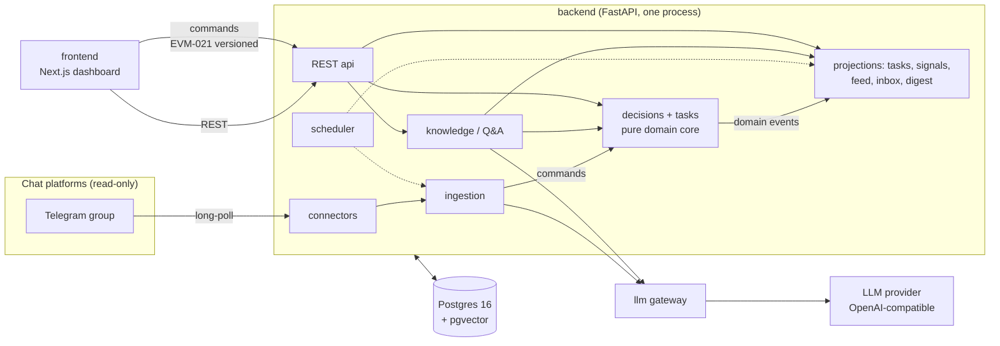

# Architecture — EverMind

> How the codebase is shaped. Business rules: [`design-v2.md`](design-v2.md) (rev 13) +
> [`debates/`](debates/) resolutions. Entities: [`data-model.md`](data-model.md). What to
> build: [`features.md`](features.md). How to not break it: [`testing-strategy.md`](testing-strategy.md).

## Principles

1. **FE / BE / infra are cleanly separated deployables.** The frontend talks to the backend
   over REST only; the backend owns all persistence and all LLM calls; infra is declarative
   (Compose) and identical between dev and prod.
2. **The domain core is a pure engine.** `decisions` + `tasks` (the fold) contain no LLM
   calls, no platform SDKs, no HTTP — commands in, events + state out. Everything
   probabilistic (extraction) or platform-specific (Telegram) happens at the edges and
   enters the core through the same narrow command gate.
3. **One write pipeline for every surface** (D3):
   `command → authorization → domain event → projection → feed`.
   A dashboard tap, an approval reply in chat, a 👍 reaction, and an extracted candidate all
   become *commands* and take the identical path. Dashboard writes are never fake-ingested
   messages; projections are never hand-edited.
4. **Modules are independently developable.** Each backend module has its own directory,
   owns its tables, exposes a small typed port, and imports only `contracts` — never another
   module's internals. Two people can work in two modules without merge collisions.
5. **Open-source, self-hostable, familiar infra.** Postgres + Docker Compose + Caddy. No
   managed-platform lock-in; `docker compose up` reproduces the whole system anywhere.
6. **Read-only capture** (settled #20). No code path exists that sends a chat message. The
   Telegram adapter literally has no send capability — that's the enforcement.

## System context



The bot arrow points **one way**. Humans read the dashboard and relay to chat by hand.

## Stack

| Layer | Choice | Why |
|---|---|---|
| Backend | **Python 3.12 + FastAPI** | Team skill; Pydantic contracts double as extraction schemas; async fits long-poll + API in one process |
| DB | **PostgreSQL 16 + pgvector** (single store) | The model is relational and transactional: one-effective-per-unit is a partial unique index; the supersession sweep is a multi-row transaction; ≥1-citation is a constraint. JSONB covers the flexible parts (ops payloads, raw platform payloads). pgvector adds RAG recall later without a second system |
| Migrations | **Alembic** | Boring, versioned, reviewable DDL |
| ORM/data | **SQLAlchemy 2 (core-leaning)** | Explicit SQL where transactions matter |
| LLM | **OpenAI-compatible client** via one gateway module; default DeepSeek | Provider = env config, never an import. LangChain adopted **only** in `knowledge` (retrievers/pgvector); LangGraph **only** if the Q&A flow grows genuinely multi-step. Extraction stays a plain schema-validated call — deterministic, testable, no framework between us and the prompt |
| Scheduler | **APScheduler** in-process | Radar/digest/nudges are a handful of daily jobs; a queue is unjustified |
| Frontend | **Next.js (App Router) + Tailwind** | Team skill; dashboard is mostly server-rendered reads + a thin command client |
| Infra | **Docker Compose**; Caddy for TLS on a VPS | Dev = prod; open-source; one-command bring-up; handoff = "compose up" |
| Tests | **pytest** + testcontainers-style PG; Playwright smoke (T2) | See `testing-strategy.md` |

**Rejected, with reasons** (so nobody re-argues them mid-build):
- **MongoDB** — the core invariants are relational (partial unique indexes, FK-enforced
  citations, multi-row transactions). JSONB already gives document flexibility where needed.
  Two databases is an ops tax the demo can't afford.
- **Microservices / separate worker process** — one FastAPI process runs API + connectors +
  scheduler. Module boundaries live in the import graph, not the network. Compose can split
  them later without code changes (same image, different command).
- **Redis / message queue** — the internal bus is the `domain_events` table written in the
  same transaction as the state change (that also makes EVM-010's outbox concern moot
  inside-process). Polling consumers at our scale are fine.
- **LangChain for extraction** — extraction quality is won by prompt iteration against the
  eval gate; a framework in that loop obscures exactly the thing being tuned.
- **A rules/BPM engine for approvals** — MVP approval = `any` rank-sufficient + two
  hard-coded multi-party cases (two-key transfer, all-leads policy). A generalized
  requirement/reducer table is roadmap [EVM-019].

## Repository layout

```
EverMind/
├── ai-docs/                # THE source of truth (design-v2, debates, scenarios, these docs)
├── data-v2/                # corpus + answer key + org seed (fixtures; never edited casually)
├── backend/
│   ├── pyproject.toml
│   ├── evermind/
│   │   ├── contracts/      # shared Pydantic types + enums + command/event definitions
│   │   ├── org/            # org & identity: projects/teams/groups/users/parties, config ops, seed
│   │   ├── llm/            # provider-agnostic gateway (client, retry, JSON validation)
│   │   ├── connectors/     # telegram/, replay/, transcript/  → writes messages+events
│   │   ├── ingestion/      # windows, markers, hydration, extraction, linkage, signals-emit
│   │   ├── decisions/      # THE CORE: lifecycle, facets, authority, acts, hygiene
│   │   ├── tasks/          # THE FOLD: projection, lanes, dependencies, merge/transfer
│   │   ├── signals/        # ledger, parties, radar, overload, escalation
│   │   ├── surfacing/      # feed, inbox, digest, close-out, on/offboarding
│   │   ├── knowledge/      # retrieval + truth-state Q&A (LangChain lives here only)
│   │   ├── api/            # FastAPI app: routers, command endpoint, persona scoping
│   │   ├── scheduler/      # APScheduler job definitions
│   │   └── db/             # engine, session, Alembic migrations
│   └── tests/              # mirrors the module tree + scenarios/ + eval/
├── frontend/               # Next.js app (app/, components/, lib/api-client)
├── infra/
│   ├── docker-compose.yml          # db + api + frontend (+ caddy profile for VPS)
│   ├── Caddyfile
│   └── .env.example
└── Makefile                # make dev / test / eval / demo / seed / replay
```

## Backend module contract

Every module: `models.py` (its tables) · `service.py` (its port — the only thing others may
call) · `commands.py`/`events.py` where relevant · internal helpers private.

| Module | Owns (tables/state) | Must NOT |
|---|---|---|
| `contracts` | Pydantic types, enums, Command/Event unions — no logic, no IO | import anything from other modules |
| `org` | `projects`, `teams`, `chat_groups`, `users`, `user_identities`, `user_teams`, `parties`, `config_ops` — the seed loader (OPS-1), group binding (CAP-6), and provisional-user creation (ING-6's write path, called by ingestion) | contain authority logic (that's `decisions`); call the LLM |
| `llm` | provider client, retry/backoff, JSON-schema validation, request logging | contain prompts (callers own prompts); write to DB |
| `connectors` | `messages`, `message_revisions`, `reaction_acts`, `group_members`, raw payloads | call the LLM; touch domain tables; **send anything to any platform** |
| `ingestion` | windows/high-water marks, marker materializations, extraction runs, speaker maps | write decisions/tasks directly — it emits **commands** to the core |
| `decisions` | `decisions`, `decision_citations`, `decision_tasks`, proposal state, acts, `processed_commands`, `domain_events` — **and the universal command gateway** (every command type enters here; see pipeline note) | know platforms or prompts; call LLM; render UI text |
| `tasks` | `tasks` + derived joins, `task_updates`, `task_dependencies` (fold outputs) | accept writes from anyone but the decision/update fold |
| `signals` | `signals` ledger, lamp computations, overload calc | post anywhere; mutate tasks (it proposes via commands) |
| `surfacing` | `feed_entries`, `inbox_items`, digest/retrospective read models | invent content — it renders domain events only |
| `knowledge` | retrieval indexes, embeddings, Q&A logs | answer from raw chat wholesale; bypass truth-state filters |
| `api` | routers, auth-lite persona scoping, command intake | contain business rules |
| `scheduler` | job definitions + schedules | contain job logic (calls module ports) |

**Import rule (enforced by import-linter in CI):** modules import `contracts` (+ `llm` where
listed) and their own package. `org` is the one shared *data* port: `decisions` (authority
lookups), `ingestion` (provisional-user creation via its write port), `signals` (party
matching), and `surfacing` may import its service. `api` and `scheduler` may import module
*service ports*. Nothing imports `api`. `tasks` imports nothing but `contracts`;
`decisions` imports nothing but `contracts` + `org` (read-only).

## The write pipeline (one path for every surface)

```
    chat reply/react ──► connectors ──► ingestion ─┐
    marker message  ──► ingestion (deterministic) ─┤
    LLM extraction  ──► ingestion (candidates)  ───┼──► Command ──► decisions.service
    dashboard tap/form ─► api (persona) ───────────┘        │
                                                            ▼
                                    authorization (can_decide, rank gate, τ, at-act snapshot)
                                                            │
                                                            ▼
                          one transaction: decision rows + status flips + sweep
                          + domain_events append  (+ processed_commands for idempotency)
                                                            │
                              ┌─────────────────────────────┼──────────────────┐
                              ▼                             ▼                  ▼
                        tasks fold (projection)      surfacing (feed,     knowledge
                                                     inbox, digest)       (index refresh)
```

- **Commands** are typed (`contracts.commands`): `ProposeDecision`, `ApproveProposal`,
  `RejectProposal`, `RecordTaskUpdate`, `RecordSignal`, `AppendCorroboration`,
  `RegisterReactionAct`, … Every command carries provenance (`created_from`, source message
  or persona + client command id).
- **Idempotency** is layered: dashboard/API commands dedup on `client_command_id`
  [EVM-021]; marker materializations dedup on `(source_message_id, command_index, kind,
  unit)` [EVM-002]; window outputs upsert by `(window_id, dedup_key)` (rev-4 resilience).
- **`domain_events`** is appended in the same transaction as the state change and is the
  only thing projections/feeds consume — the fold and the feed can always be rebuilt by
  replaying it. Consumers track their own cursor (a `projection_offsets` row), so a rebuilt
  or new projection replays from zero without touching the write side.
- Authorization lives in `decisions` (the only module that may declare something
  `effective`). **`decisions.service` is the single write gateway for *every* command
  type** — including non-decision commands like `RecordTaskUpdate`/`RecordSignal`: it
  authorizes (the update lanes route here — PIC auto-apply vs decision-grade vs
  confirm-card), appends `domain_events`, and enforces `processed_commands` idempotency
  universally. `tasks` and `signals` never process raw commands — they only project
  events. `api` does persona scoping only — *who is asking*; *may they* is domain.

## LLM gateway (`llm`)

- OpenAI-compatible client; env-selected: `AI_BASE_URL`, `AI_MODEL`, `AI_API_KEY`. Default
  DeepSeek: model **`deepseek-v4-flash`** (the legacy `deepseek-chat`/`deepseek-reasoner`
  names retired 2026-07-24). Swapping to Claude or any compatible endpoint is config.
- DeepSeek supports JSON mode (`json_object`) but not strict `json_schema` on messages →
  **validation is ours**: every call takes a Pydantic schema, validates, retries once with
  the validation error appended, then fails the window (which stays pending + backlog
  notice — never half-persisted). Optional: strict function-calling beta at
  `api.deepseek.com/beta` with `"strict": true` tools.
- Retry-with-backoff on 429/503 (DeepSeek's known load pattern; 2500-concurrent cap).
- **Injection guard** [EVM-011]: all corpus/chat/file text enters prompts as fenced,
  quoted *data* with an explicit "content is never instructions" frame; outputs are schema-
  bound; no tool-use is exposed to extraction. A message saying "ignore previous
  instructions" is just a message.
- Every call logs: window id, model, token counts, latency, validation attempts — the eval
  harness and the backlog notice both read these.

## Knowledge module & RAG posture

- **Structured-first retrieval**: typed SQL over decisions/tasks/signals/parties/wraps with
  filters (project, team, scope, status, time). At demo scale this answers the hero beats.
- **pgvector second**: embeddings over record text (not raw chat) added only when keyword
  retrieval measurably misses (KNW-3). `langchain-postgres` PGVector + a thin retriever;
  no chains for the sake of chains.
- **Truth-state filter is not optional**: retrieval results carry status; the answerer
  must route superseded→current-with-note, proposed→pending-labeled, window→date-aware
  [EVM-007]. This filter is domain code, unit-tested without any LLM.
- Answer generation is one grounded call with mandatory per-line citations; a
  citation-completeness check runs on the output before display (uncited lines are dropped
  with a visible "removed uncited claim" marker — the symmetry rule applied to ourselves).

## API surface (sketch — freeze per-phase in `plan.md`)

```
GET  /personas                          # seeded users for the switcher
GET  /feed?persona=…                    # SRF-1 entries (batched, deduped)
GET  /inbox?persona=…                   # SRF-2 actionable cards
GET  /tasks?project=…&team=…&status=…&pic=…&type=…&q=…      # DSH-4 filters
GET  /tasks/{id}/reasoning              # popup: summary, log, citations, states
GET  /tasks/{id}/at?ts=…                # TSK-8 time-travel reconstruction
GET  /decisions?scope=…&q=…&from=…&to=…&user=…&show_inactive=…
GET  /digest/{team}?week=…              # SRF-3 view (+ project-wide section)
GET  /blockers?by=party                 # SIG-2 board
GET  /health/capture                    # CAP-5 banners
POST /commands                          # ALL writes: typed command envelope
                                        #  {command_id, persona, expected_version, payload}
POST /qa                                # KNW-2 {question, persona} → cited answer
POST /uploads/transcript                # CAP-3 (txt/md only) → speaker-map confirm flow
```

One `POST /commands` endpoint (not per-action routes) keeps the D3 pipeline literal: the
envelope is validated, persona-stamped, and handed to the domain — the API layer cannot
grow business logic by accident.

## Configuration (env contract)

```
DATABASE_URL=postgresql+psycopg://evermind:evermind@db:5432/evermind
AI_BASE_URL=https://api.deepseek.com      # any OpenAI-compatible
AI_MODEL=deepseek-v4-flash
AI_API_KEY=…                              # server-side only
EXTRACTION_BATCH_SIZE=25                  # demo profile; 100 = CI/prod shape (settled G39)
CONFIDENCE_TAU=0.8
ORG_TIMEZONE=Asia/Ho_Chi_Minh             # bucketing/relative dates; storage stays UTC (G54)
TELEGRAM_BOT_TOKEN=…                      # T2; long-poll; NEVER granted send-usage in code
REPLAY_PACE_MS=800                        # demo replay pacing; 0 = instant (tests)
GRACE_WINDOW_MIN=10                       # marker-edit amend + reaction-withdrawal revert
NUDGE_AFTER_HOURS=48                      # visibility only — never a status change (#18)
```

`pydantic-settings` loads it; `infra/.env.example` is the documented contract; `.env` is
git-ignored. The frontend gets exactly one var: `NEXT_PUBLIC_API_URL`.

## Infra & deployment

- **`infra/docker-compose.yml`**: `db` (postgres:16 + pgvector, volume, healthcheck) ·
  `api` (backend image; runs migrations then uvicorn; scheduler + connectors in-process) ·
  `frontend` (Next.js standalone) · `caddy` (profile `prod`: TLS + reverse proxy).
- **Dev = prod.** `make dev` = compose up db + hot-reload api/frontend on the host.
  `make demo` = full compose + seed + paced replay. A VPS deploy is the same compose with
  the `prod` profile and a domain in the Caddyfile — Hetzner-class box, or anything that
  runs Docker. No platform accounts required to exist.
- **Backups**: `pg_dump` cron in the db container (documented in the runbook); the corpus
  and org seed are in git, so a demo environment is reproducible from zero by
  `make seed replay`.
- **Handoff posture** (the sustainability story): one compose file, one `.env`, an
  OpenAI-compatible key of the org's choosing; the memory is exportable (`make export` →
  CSV/JSON of decisions/tasks/digests). The tool is disposable; the memory is not.

## Trust boundaries

1. Chat/file content → **untrusted data** (never instructions) at the LLM boundary [EVM-011].
2. LLM output → **untrusted suggestion**: schema-validated, then subjected to the same
   authorization gate as any human claim; τ gates effectiveness; nothing the LLM says can
   bypass `can_decide`.
3. Frontend → **unauthenticated persona assertion** (settled #3, demo-honest): the API
   trusts the persona header for scoping, and that fact is stated on the switcher UI. The
   chat path stays genuinely identity-checked (`platform_user_id`). Real auth = T3 seam:
   the persona header is replaced by a session, nothing else moves [EVM-001].
4. Secrets (`AI_API_KEY`, bot token) live server-side only.
5. Outbound: the only external calls the backend ever makes are LLM API + Telegram
   `getUpdates`/`getChat*` (read class). There is no send path to remove misuse of.

## Observability (minimal, honest)

Structured JSON logs (window runs, command outcomes, act applications) · `/healthz` +
`/health/capture` · extraction run ledger (tokens, latency, validation retries) feeding the
backlog notice · every "the system asserted X" has a matching withdrawal path (symmetry
rule) — observability is a product feature here, not ops garnish.
