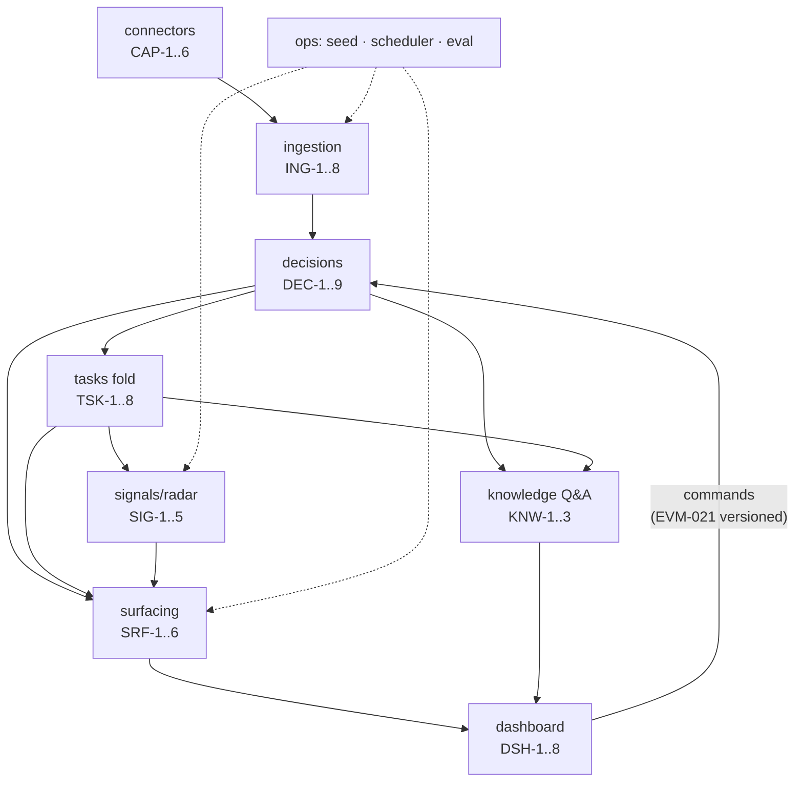

# Features — EverMind (v2 catalog, from design-v2 rev 13 + debate resolutions)

> **This catalog is build guidance, not business truth.** The business rules live in
> [`design-v2.md`](design-v2.md) (rev 13), the 23 resolved debates in [`debates/`](debates/),
> and the scenario register [`scenarios/README.md`](scenarios/README.md) (G1–G69). Where this
> file compresses a rule, the source wins. Items marked `[EVM-xxx]`/`[D#]` come from the debate
> resolutions (the "rev-14 queue") and are as binding as rev-13 text.
>
> Module names (`connectors`, `ingestion`, `decisions`, `tasks`, `signals`, `surfacing`,
> `knowledge`, `dashboard`, `ops`) match [`architecture.md`](architecture.md). Complexity:
> **S** ≈ hours · **M** ≈ half-day–day · **L** ≈ 1–3 days · **XL** = open-ended quality
> iteration. Tier: **T1** = required for the hero demo (everything `data-v2/answer_key.json`
> exercises) · **T2** = full product surface, build after T1 is green · **T3** = roadmap.

## Product rules that bind every feature

1. **Decisions are the write path; tasks are the projection.** A task row is the fold of
   effective decisions + PIC updates. Nothing hand-edits a projection. (settled #2)
2. **Append-only.** A decision's body is immutable; only `status` flips. Supersession,
   sweep, resurrection are status choreography — history is never rewritten. (settled #2)
3. **Proposals never expire.** Only a human act changes a status: approve · deny/veto/dismiss ·
   same-unit effective write (overruled — an act, not a clock) · proposer's own withdrawal.
   Clocks may *create visibility* (nudges, aged listings) but never change state. (settled #18)
   Scope: **decision statuses**. The signal ledger is deliberately different — working
   memory that may expire or promote on staleness (SIG-1, G35).
4. **The bot never posts to groups.** Capture is read-only; every output surfaces on the
   dashboard (per-persona feed, approver inbox, team digest views). Humans relay to chat by
   hand. Chat-side acts ride the **source messages** (approval reply / 👍 react). (settled #20)
5. **Precision >> recall.** A missed decision is invisible; an invented one destroys trust.
   Confidence gate (τ = 0.8) — below it, born `proposed`, never silently dropped.
6. **Receipts everywhere.** Every chat-originated record carries ≥1 evidence citation
   (enforced). Citations pin revisions; edited evidence is badged, never silently re-read.
7. **Symmetry rule.** Anything the system asserted, it maintains or withdraws — retraction
   entries, backlog notices, green-light retractions, capture-health lines.
8. **Work, not people.** No rankings, no leaderboards, no per-person performance metrics —
   ever. Overload warnings are bounded, task-centric, and warn-don't-block. [EVM-017]
9. **Hierarchy modeled, not enforced** for the demo: persona switcher, no login; the chat
   path is genuinely identity-checked via `platform_user_id`. Real auth = T3. (settled #3)
10. **One group ↔ one project, permanently.** New season = new group. (settled #13b)

---

## Module: connectors (message crawling)

| ID | Feature | Tier | Cx | Depends on |
|----|---------|------|----|-----------|
| CAP-1 | Canonical message inbox (platform contract) | T1 | M | — |
| CAP-2 | Replay connector (corpus JSONL) | T1 | S | CAP-1 |
| CAP-3 | Transcript upload connector | T1 | M | CAP-1, ING-8 |
| CAP-4 | Telegram live connector (read-only) | T2 | M | CAP-1 |
| CAP-5 | Capture health monitoring | T2 | M | CAP-4 |
| CAP-6 | Group↔project binding config | T1 | S | — |

- **CAP-1 — Canonical message inbox.** One normalized shape for everything: `messages` +
  `message_revisions` (edits append, never overwrite — G45), media kinds with captions (G46),
  `forward_origin`, membership events (→ `group_members`, G69), and reaction events **on
  tracked messages only** (→ `reaction_acts`, G67). Platform quirks (id migration, privacy
  modes, delete signals) are adapter concerns, never core rules. (settled #13a)
- **CAP-2 — Replay connector.** Feeds `data-v2/corpus.jsonl` through the same path as live
  capture; instant mode (tests) and paced mode (demo beat: records materialize on screen).
  Replay corpora carry no reactions by design — the dashboard tap is the demo-equivalent act.
- **CAP-3 — Transcript upload.** `[MM:SS] Name: text` parsing, attendee header, per-upload
  speaker map auto-seeded from `users.name` and confirmable at upload (G30); upload = its own
  window(s), **flush on completion** (G29). Accepts `.txt`/`.md` only. [EVM-011]
- **CAP-4 — Telegram live connector.** Long-polling `getUpdates`; **never sends** (settled
  #20 — read-only capture is also the whole permission story). Normalizes edits, media,
  membership, and reactions-on-tracked. Runbook facts: privacy mode must be disabled via
  BotFather *before* joining the group; bots cannot backfill history (hence CAP-2); bots
  can't see other bots; chat-id migration is absorbed here (G53).
- **CAP-5 — Capture health.** Bot-membership loss → coordinator feed alert + dashboard
  banner; daily membership self-check per mapped group; digest carries "⚠ no capture from
  <group> since <date>" while dark — a severed feed is never presented as a quiet week (G53).
- **CAP-6 — Group binding config.** `chat_groups.project_id` set once at registration,
  permanent (settled #13b; EVM-009 rejected remapping). Config ops are logged operations,
  not decisions.

## Module: ingestion (windows, markers, extraction, linkage)

| ID | Feature | Tier | Cx | Depends on |
|----|---------|------|----|-----------|
| ING-1 | Marker lane (deterministic) | T1 | M | CAP-1 |
| ING-2 | Windowing engine | T1 | L | CAP-1 |
| ING-3 | Reply-target hydration | T1 | M | ING-2 |
| ING-4 | LLM extraction | T1 | **XL** | ING-2, ING-3, OPS-3 |
| ING-5 | Linkage resolver | T1 | L | ING-4, TSK-1 |
| ING-6 | Provisional-user arrival | T1 | M | CAP-1 |
| ING-7 | Late-arrival ordering | T1 | M | DEC-1 |
| ING-8 | File-content trust boundary | T1 | S | — |

- **ING-1 — Markers.** `!decision` / `!blocked` / `!progress` / `!depends`, optional `T-…`
  refs; instant, deterministic, confidence 1.0. Bare markers create the record immediately;
  only *attachment* runs through the linker (G24). Edits within the ~10-min grace window
  amend (typo lane); later edits badge only. **Dedup:** materializations are unique on
  `(source_message_id, command_index, kind, unit)` — a window re-extracting a marker message
  yields `already_materialized` context, never a duplicate record. [EVM-002]
- **ING-2 — Windowing.** Per-group high-water mark; at +`EXTRACTION_BATCH_SIZE` (demo 25,
  CI/prod 100) one LLM pass over exactly that contiguous window; non-overlapping,
  each message extracted once (settled #6). Bulk sources flush on upload (G29);
  digest/radar force **flush-before-read** (G8). Window runs are transactional (mark advances
  only when outputs persist) and idempotent (outputs upsert by `(window_id, dedup_key)`);
  failures leave a visible **backlog notice**, never silently-stale views. Context tail:
  last ~20 messages of the previous window ride along cite-only.
- **ING-3 — Hydration.** For window messages whose `thread_ref` leaves the window, inject the
  target (+parent, ≤2 hops) as `[replied-to]` context — never re-extracted, always citable
  (G50). This is what makes "ok chốt" a decision with receipts on both messages.
- **ING-4 — LLM extraction.** Window → proposed decisions (scope task/team/project, typed
  `ops`, supersedes-*suspicion* only), proposed `task_updates`, `signals[]`,
  `corroborations[]` (G66: value-match on a candidate effective decision → citation append,
  never a new record). Exception language ("CN này", "riêng buổi…") → `effect_window`
  decision, never a supersession (G42). Confidence per record; τ gates effectiveness. The
  XL is prompt-quality iteration against the eval gate — see `testing-strategy.md`.
- **ING-5 — Linkage.** Candidates = project's open tasks (group's team first) + target
  scopes' effective policies/attrs + open signals + slim foreign index (id+title of other
  projects' open tasks, listed last). Returns `task_id | task_id@foreign-project | NEW_TASK |
  TEAM_POLICY | PROJECT_POLICY | UNLINKED(triage)`. Foreign-linked content is **never born
  effective** — routed `proposed` to the owning project's authority (G68; accepted residual:
  that costs one tap). `UNLINKED` triage waits indefinitely for a human — no clock. [EVM-022]
- **ING-6 — Provisional arrival.** First message from an unknown `platform_user_id` in a
  mapped group → provisional user (rank 1, full member experience), lead gets a one-tap
  confirm card (G44). User rows are created via the `org` module's write port — ingestion
  triggers, `org` owns. Pruning after N quiet days **only if they hold nothing**; with
  holdings → kept + mini-sweep (one reassignment proposal per held task) (G62). Rejoins
  reuse the known id — never a duplicate provisional (G69).
- **ING-7 — Late arrival.** Fold and supersession direction use event `ts`, not arrival;
  `recorded_at` kept separately; an older same-unit decision is born **already-superseded**,
  entering history without disturbing the present (G31). Deterministic ordering tiebreak:
  `event_ts → recorded_at → stable_event_id`; impossible chronology → triage. [EVM-012]
- **ING-8 — Trust boundary.** All ingested content (chat text, transcripts, file text) is
  **untrusted quoted data, never instructions** — prompts wrap it as data and extraction
  output is schema-validated; a message saying "ignore previous instructions" is just a
  weird message. Re-upload of a file = a new version, never an overwrite. [EVM-011]

## Module: decisions (logging decisions — the core engine)

| ID | Feature | Tier | Cx | Depends on |
|----|---------|------|----|-----------|
| DEC-1 | Decision store + lifecycle | T1 | M | — |
| DEC-2 | Facet registry + supersession units | T1 | L | DEC-1 |
| DEC-3 | Effective-write transaction | T1 | L | DEC-2 |
| DEC-4 | Authority gate | T1 | L | OPS-1 |
| DEC-5 | Approval acts | T1 | L | DEC-1..4 |
| DEC-6 | Rejection, challenge, resurrection | T1 | M | DEC-3 |
| DEC-7 | Proposal hygiene | T1 | M | DEC-1 |
| DEC-8 | Effect-window exceptions | T1 | M | DEC-2 |
| DEC-9 | Multi-op atomicity | T1 | S | DEC-3 |

- **DEC-1 — Lifecycle.** `proposed → effective → superseded` / `→ rejected` with
  `rejected_reason: veto|overruled|withdrawn|dismissed`. Born-effective requires cited
  authorized (or delegated — G25) author AND confidence ≥ τ; markers/dashboard are
  human-asserted (1.0). Below τ or relayed → `proposed`, tagged to the claimed maker
  (self-confirm 👍). **No TTL anywhere** (settled #18).
- **DEC-2 — Facet registry.** Supersession unit = (scope-target, facet-key); at most ONE
  effective decision per unit, enforced at write; effective-writes serialize per target.
  Full ops table (assignment add/remove/set per person-slot, `attr:<name>`, note append,
  merge, project transfer, project end_date…) is design-v2 §Facet registry — implement it
  as a *registry*, not scattered ifs.
- **DEC-3 — Effective-write transaction.** One transaction: insert new · flip same-unit
  predecessor to `superseded` (+ back-pointer) · sweep same-unit proposeds →
  `rejected(overruled)` with `superseded_by := winner` (G11/G12) · **same-value guard**:
  a candidate equal to the standing ops (op + value) becomes a corroborating citation on
  the standing decision — attribution and `ts` never move (G66).
- **DEC-4 — Authority.** `can_decide(actor, unit)` is a **total function** (G48): task-scoped
  via manager chain over any owning team; NEW_TASK vs the chat group's team (G3); team policy
  = that lead+; project policy = coordinator or all-leads. Rank gate for supersession:
  `rank(actor) ≥ rank(old maker, snapshotted)` (G10). Rootless fallback + peer-conflict hold
  (incomparable ranks → held `proposed`, both leads tagged; the hold waits for a human, #18).
  Authority is evaluated **at act time** and snapshotted on the act. [EVM-005]
- **DEC-5 — Approval acts.** Equivalent lanes: dashboard tap · 👍 reaction on the proposal's
  source message (instant, no LLM — G67) · affirmation reply ("ok chốt", "duyệt") /
  negation ("thôi", "khỏi") — deterministic phrase list first, LLM for ambiguity (G50).
  Every act binds to the revision the approver saw: `rev_at_act`; capture-time mismatch →
  born `proposed` + diff card + one-tap re-confirm (G65). Approval-time revalidation
  re-checks targets *now*: canceled → approve-as-revive or dismiss; merged → redirect to
  survivor; value moved → diff before confirm (G52). Reaction removal: within grace →
  auto-revert to `proposed` + retraction entry; after grace → files a challenge, badge until
  resolved (G67). Dashboard commands carry expected unit version + client command id —
  stale forms get the diff card, retries are idempotent. [EVM-021]
- **DEC-6 — Rejection & resurrection.** Veto by maker or rank ≥ maker; others file a
  challenge the maker resolves (G18). Rejecting a decision resurrects what it superseded
  (iff no other effective superseder) and refolds (G17). Any surfaced-then-rejected record
  triggers retraction entries; the next digest leads with corrections (G20).
- **DEC-7 — Proposal hygiene.** Same (unit, op, value) pendings merge — citations union,
  proposers listed, one queue entry (G49). Different values stay separate only across
  different proposers; a proposer's own new value **withdraws** their older pending
  (`rejected(withdrawn)`, linked — settled #17b). Approver bulk actions (approve all /
  dismiss all from person / dismiss stale = explicit acts). Anti-rot is visibility: one
  approver nudge at 48h + aged listing in every digest (settled #18).
- **DEC-8 — Exceptions.** `effect_window` decisions shadow the standing same-unit decision
  inside their window and the fold auto-un-shadows after — no supersession, no status change
  (G42). **Overlapping windows on one unit → the later is held `proposed`** for a human. [EVM-004]
- **DEC-9 — Multi-op atomicity.** A multi-op decision is all-or-nothing: routed whole to
  the highest authority any op requires, effective as one, superseded per-unit downstream.
  No bundle entity. [EVM-003]

## Module: tasks (logging tasks — the projection)

| ID | Feature | Tier | Cx | Depends on |
|----|---------|------|----|-----------|
| TSK-1 | Task projection fold | T1 | L | DEC-3 |
| TSK-2 | Update lanes | T1 | M | TSK-1 |
| TSK-3 | Dependencies (DAG) | T1 | M | TSK-1 |
| TSK-4 | Merge & split | T2 | M | TSK-1, TSK-3 |
| TSK-5 | Cross-project transfer | T2 | M | TSK-3, DEC-4 |
| TSK-6 | Terminal-state locks | T1 | M | TSK-1 |
| TSK-7 | Date governance | T1 | M | TSK-1, OPS-4 |
| TSK-8 | Time-travel replay | T1 | M | DEC-1, TSK-1 |

- **TSK-1 — Fold.** `tasks`, `task_assignments`, `task_teams` are **derived** (G2): the
  ts-ordered fold of effective decisions (windowed exceptions applied only in-window) +
  `task_updates`. Multi-PIC supported via per-person-slot assignment ops (G1; the
  stakeholder's "một task có thể có nhiều PIC"). Parent linkage `parent_task_id` for splits;
  parent status is **never derived** from children. [EVM-014]
- **TSK-2 — Update lanes.** Cited author is a PIC → auto-apply status/note (the review's
  carve-out, G7); authority → decision-grade; anyone else → PIC confirm card (G9).
  PIC statements consistent with standing decisions = notes; only contradiction escalates
  (G13). Lead wrap-shaped messages → team-scoped note, quoted by the digest (G34).
- **TSK-3 — Dependencies.** Blocks-only DAG, cycle check at write; created/removed by
  decisions; `requested` vs `confirmed` (only confirmed edges lamp — G16). Admission matrix
  (G51): same project ✓ · campaign↔program ✓ (escalation via coordinator) ·
  program↔program ✓ · campaign↔different-campaign ✗. **Only `done` satisfies** a
  dependency; a canceled predecessor flips dependents' edges to `needs-rewire` — never
  silently "unblocked". [EVM-006]
- **TSK-4 — Merge & split.** Merge re-points everything, unions assignments, drops
  pair-internal edges, re-runs the DAG check (G43, G60); the husk auto-redirects ops to the
  survivor. Split = compose: create children + refine parent (`parent_task_id`). [EVM-014]
- **TSK-5 — Transfer.** Two-key (source lead + destination lead; coordinator alone
  suffices); in-transaction edge revalidation vs G51 (violations → needs-rewire), re-team,
  re-dating, pending proposals → `pending-revalidation` re-routed (G59).
- **TSK-6 — Terminal locks.** `canceled`/`merged` lock the lanes: notes only; a PIC's
  progress on a canceled task gets the canceling decision named (dashboard-side); reopen =
  a lead `revive` decision (G52).
- **TSK-7 — Dates.** Campaign task without `end_date` defaults to `project.end_date − 1 day`
  + `end_date_defaulted` flag (cleared only by human confirm); `task.end > project.end` →
  warning; programs and `kind=ongoing` exempt; warnings never block (stakeholder rule + G56).
  `projects.kind: campaign|program` is an explicit column; `end_date` is independent data
  (campaign without a date = warned, no defaulting until dated). [D4] Reschedule cascade on
  project end_date change (G57).
- **TSK-8 — Time-travel.** Reconstruct any task's state at any `ts` (event-time replay,
  dual stamps when `recorded_at` differs) — powers the reasoning popup's click-a-decision →
  see-the-task-then (stakeholder "button reasoning"; S15).

## Module: signals (surfacing blockers)

| ID | Feature | Tier | Cx | Depends on |
|----|---------|------|----|-----------|
| SIG-1 | Signal ledger | T1 | L | ING-4 |
| SIG-2 | Blocked structure + parties | T1 | M | TSK-1 |
| SIG-3 | Radar lamps + daily job | T1 | L | TSK-1..3, OPS-4 |
| SIG-4 | Overload guard | T2 | M | TSK-1 |
| SIG-5 | Escalation routing | T1 | M | SIG-3 |

- **SIG-1 — Ledger.** The cross-window memory for weak signals (`blocker|dependency|ask|
  parked`). One mention never promotes; ≥2 corroborating signals or 1 + staleness →
  proposed `blocked` state or `requested` edge, citations = all accumulated mentions (G27 —
  this is what catches the implicit permit blocker B-2). Signal identity key =
  `(project, task?, party?, normalized-topic)`; an *asserted* blocked state is never
  auto-resolved by signals. [EVM-013] Signals expire when contradicted or after N quiet
  days; `parked` ("để sau") and unanswered asks surface in the digest after N days (G35).
- **SIG-2 — Blocked + parties.** Structured wait: `waiting_on` (party FK via alias
  fuzzy-match, confirm on first use, else text; the `parties` table itself lives in the
  `org` module — signals consumes its port), `since`, owner (G22, G32). Radar ages off
  `since`; digest groups open blockers **by party** ("3 teams waiting on chi Yến").
  Asserted `blocked` chip vs computed dependency lamp render distinctly (G15).
- **SIG-3 — Radar.** Daily job (flush-before-read): lamps `blocked` · `at-risk` · `overdue` ·
  `stale` (in-doing, no event N days) · `idle` (todo, no event 14 days — catches dateless
  program zombies, G56) · `late-start` · `contested` (≥3 flips, ≥2 actors, 7 days → suggest
  compose-split, G55). Cadence: PICs day 1 → +LCA day 3 → every 3 days; max one entry per
  task per day; `urgent` immediate. Green-light retraction: a task leaving `done` sends the
  inverse of every "unblocked" entry it caused (G55). Unreachable-PIC flag (in no home
  group) once per cycle to the lead (G69).
- **SIG-4 — Overload.** Per-day concurrent load, next 14 days, across all the person's
  teams (urgent ×2, due-≤7d extra). Warn-don't-block; chat-made assignments get a post-hoc
  flag on the decision + both feeds; silence = acceptance, noted (G4). Bounded: no history
  mining, no rankings, no cross-person comparison views. [EVM-017]
- **SIG-5 — Escalation.** LCA routing with rootless fallback; cross-boundary
  (campaign↔program) escalations raise **one card per endpoint side**, each seeing only its
  own task + the carve-out projection of the other, coordinator sees both (G63).

## Module: surfacing (feeds, inbox, digests)

| ID | Feature | Tier | Cx | Depends on |
|----|---------|------|----|-----------|
| SRF-1 | Per-persona feed | T1 | L | DEC-*, TSK-*, SIG-* |
| SRF-2 | Approver inbox + receipts | T1 | M | SRF-1 |
| SRF-3 | Team digest views | T1 | L | SRF-1, SIG-* |
| SRF-4 | Close-out + retrospective | T2 | M | TSK-1, SRF-3 |
| SRF-5 | Onboarding brief | T2 | S | KNW-1 |
| SRF-6 | Offboarding sweep | T2 | M | TSK-1, DEC-7 |

- **SRF-1 — Feed.** Every notification is a dashboard feed entry (settled #20): per
  **decision**, not per task; material changes only; recipients = maker, PICs, dependent
  PICs, approver. Entries batch (~30 min) + dedup per person; retractions append to the
  original entry. Acts that didn't take effect stay visible to their actor (failed approval,
  collapsed repeat paste).
- **SRF-2 — Inbox + receipts.** Anything awaiting a person's act: proposals (always in the
  approver's inbox + team pending queue — pending ≠ invisible), confirm cards (G44 arrivals,
  non-PIC updates), challenges, diffs (G52/G65), triage (UNLINKED). **Capture receipt**: when
  a window commits, the proposer's feed shows what was captured — target or UNLINKED,
  current/proposed values, required approver, "the projection has not changed". [EVM-022]
  Honest residual (accepted): a member who never opens the dashboard has no receipt — the
  recorded trade of settled #20; the deterministic fallback is the marker lane.
- **SRF-3 — Digests.** Per-team dashboard views (a lead may paste one into chat — humans
  relay): corrections first · decisions with receipts · completed/created · blockers by
  party, aged · lamps · pending proposals (grouped, aged — no expiry) · parked/asks past N
  days · needs-attention (idle, dateless/unconfirmed dates, unreachable PICs, capture
  health) · overload flags · project-wide section (team-less tasks + policies, G48) ·
  **the freshest team wrap note quoted verbatim** (attributed + cited — the leads' numbers
  ride along without a metrics engine, G34).
- **SRF-4 — Close-out.** `active → closing → closed` (G41): closing stops overdue-pinging
  and raises one close-out sweep checklist per team (done / canceled(obsolete) / migrate to
  a program project — each a normal decision). `closed` generates the **retrospective
  digest** (shipped / didn't / decisions with rationale + supersession context / next-time
  policies / final counters) — archived, quotable by Q&A. This retrospective is the v0
  publication bundle; the curated owner-reviews/coordinator-approves flow activates with
  ACLs. [EVM-020]
- **SRF-5 — Onboarding brief.** The mirror read per team: active tasks, effective decisions
  incl. policies, open blockers with parties — the volunteer-rotation founding beat.
- **SRF-6 — Offboarding sweep.** `departing` → proposed reassignments, approval re-routing,
  parties only they chase, accesses named in their blockers (G33). `departed` leaves
  history untouched. Group-leave ≠ org departure — only an explicit config op/decision
  triggers this sweep (G69).

## Module: knowledge (chatbot over the knowledge base)

| ID | Feature | Tier | Cx | Depends on |
|----|---------|------|----|-----------|
| KNW-1 | Retrieval over records | T1 | M | DEC-*, TSK-*, SIG-* |
| KNW-2 | Truth-state-aware cited Q&A | T1 | L | KNW-1 |
| KNW-3 | Semantic retrieval (pgvector) | T2 | M | KNW-1 |

- **KNW-1 — Retrieval.** Structured-first: SQL/keyword over decisions (description, context,
  attrs), tasks, signals, parties, wrap notes, retrospectives — records are small and typed;
  filters (project, team, scope, time range, status) do most of the work on demo-corpus
  scale.
- **KNW-2 — Q&A.** Grounded strictly on records (never raw chat wholesale); every answer
  line cites record + source message + date. **Truth-state aware** [EVM-007]: answers from
  `effective` by default; a superseded hit answers with the *current* decision, noting the
  change ("was X, superseded by Y on <date>"); `proposed` reported as pending, never as
  fact; effect-window exceptions answered window-aware ("this Sunday only — the standing
  policy stays"). May cite corroborating messages alongside the deciding source (G66). The
  three hero beats (`data-v2/README.md`): LED supersession · exception window · transcript
  budget cap + chat corroboration.
- **KNW-3 — Semantic retrieval.** pgvector embeddings over record text as a *recall*
  supplement when keyword retrieval demonstrably misses — measured first, added second.

## Module: dashboard (frontend)

| ID | Feature | Tier | Cx | Depends on |
|----|---------|------|----|-----------|
| DSH-1 | Shell + persona switcher | T1 | M | api |
| DSH-2 | Feed + inbox views | T1 | M | SRF-1, SRF-2 |
| DSH-3 | Task board + reasoning popup | T1 | L | TSK-*, SRF-1 |
| DSH-4 | Decision & policy logs (search/filter) | T1 | M | DEC-* |
| DSH-5 | Digest + blocker board views | T1 | M | SRF-3, SIG-* |
| DSH-6 | Q&A box | T1 | S | KNW-2 |
| DSH-7 | Dashboard write lane | T1 | L | DEC-5, SRF-2 |
| DSH-8 | Health banners | T2 | S | CAP-5 |

- **DSH-1 — Shell.** Persona switcher (settled #3): pick any seeded user; all views scope to
  that persona. No login for the demo; `departed` personas hidden.
- **DSH-3 — Task board + popup.** Board with lamps/chips; the **reasoning popup**
  (stakeholder spec): grounded summary from decisions+updates+citations only · related
  decision log newest→oldest with maker/time/status · show-inactive toggle (superseded AND
  rejected, badged with reason incl. challenges) · **click any entry → task state
  reconstructed at that ts** (TSK-8) · dual stamps · citation badges with evidence state
  (live / edited-after-capture / source-deleted / redacted [EVM-015]) and kind-aware media
  rendering (📷 fetch-on-click).
- **DSH-4 — Logs.** Decision log: search by id/context/description; filter by time range,
  week, user (stakeholder spec). Task log: search id/description; filter time/PIC/team/
  status/type. Policy log = the same view filtered by scope (team/project).
- **DSH-7 — Write lane.** Proposal forms + approve/dismiss/confirm taps. Every command
  carries expected unit version + client command id: version mismatch → diff card +
  reconfirm, retries idempotent [EVM-021]; acts run the identical authorization path as
  chat acts (D3 pipeline). Submitting shows the capture receipt [EVM-022].

## Module: ops (org config, scheduling, eval)

| ID | Feature | Tier | Cx | Depends on |
|----|---------|------|----|-----------|
| OPS-1 | Org seed loader | T1 | S | — |
| OPS-2 | Compose stack + env contract | T1 | M | — |
| OPS-3 | Extraction eval harness | T1 | M | ING-4 |
| OPS-4 | Scheduler | T1 | S | — |

- **OPS-1 — Seed.** `data-v2/org.json` → projects (Trăng Rằm campaign + Weekend Classes
  program), teams, groups (`aiv-trungthu`, `aiv-classes`), users with `role_rank` +
  manager chain (linh = coordinator), `user_teams` (matrix members), parties. Config ops
  are logged, not decisions. No org-admin UI (settled #7). Platform-scoped identity keys;
  never merge users by display name. [D5] Code home: the **`org` module** (the OPS group
  is a feature grouping — eval lives in tests, scheduler in its own module).
- **OPS-3 — Eval.** `make eval`: replay → extraction over production-shape windows → score
  vs `data-v2/answer_key.json`. Gate: decision precision ≥ 0.9 · linkage ≥ 0.8 · citation
  completeness on planted boundary cases · corroboration TD-2 produced · distractors
  (X-1..X-4) extract to nothing. Full spec: `testing-strategy.md`.
- **OPS-4 — Scheduler.** APScheduler: daily radar, digest generation, 48h approver nudges
  (visibility only — clocks never change status), daily membership self-check. All
  bucketing/relative dates in `ORG_TIMEZONE` (demo `Asia/Ho_Chi_Minh`); storage UTC (G54).

---

## Dependency graph (module level)

Build order follows the arrows: the decision engine (DEC) and fold (TSK) are pure domain
logic with no LLM and no platform dependency — they are built and tested first against
scripted events; ingestion feeds them; surfacing/knowledge/dashboard read from them.

## The hero demo path (what T1 must add up to)

Replay `data-v2` paced (CAP-2, batch 25) → markers fire instantly (ING-1) → windows extract
(ING-2..5) → decisions live their lifecycle on screen: born-effective, approval-by-reply
D-03, supersession D-10⊃D-03, overrule sweep D-11⊂D-12, exception DC-05 shadowing DC-01,
confidence-gated joke X-3 (DEC-*) → tasks fold with multi-PIC and dependencies (TSK-*) →
the implicit permit blocker B-2 promotes from three cross-window mentions (SIG-1) →
transcript uploads mid-replay and flushes TD-1/TD-2/TB-1 (CAP-3) → trang arrives provisional
(ING-6) → digest views + radar lamps + approver inbox populate (SRF-*, SIG-3) → the three
hero Q&A answer with receipts (KNW-2) → an approval tap on the dashboard makes a pending
proposal effective, with capture receipt and feed entry (DSH-7). The bot posts nothing,
anywhere, at any point.

## Accepted gaps & revisit triggers (do not re-litigate; monitor)

| Gap | Accepted because | Revisit trigger [EVM-018] |
|---|---|---|
| G61 peer-lead churn detection | Niche in a 10-person NPO; flips already visible | ≥3 rank-equal flips on one unit in 14 days |
| G64 in-negotiation proposal state | Pending IS the truth of a negotiation | ≥3 amendments on one proposal |
| G68 residual (out-of-room never effective) | Predictability of "which room changes my task" is worth one tap | >~3 foreign-routed proposals/week |

## T3 roadmap (deliberately not now)

Real auth + project-scoped read ACLs [EVM-001, D8] · curated publication bundles with
`org_published` visibility [EVM-020] · retention/deletion/redaction policy [EVM-015] ·
full office-format ingestion [EVM-011] · voice transcription · bi-temporal queries · rule
engine ("overrun needs sign-off") · metrics beyond counters · generalized
`approval_requirement`/reducer (MVP hard-codes: `any` rank-sufficient + two-key transfer +
all-leads project policy) [EVM-019] · multi-step approval chains · delegation grants ·
additional chat adapters (Slack/Discord export) through the same platform contract ·
`completion_requires_approval` opt-in [EVM-019].
