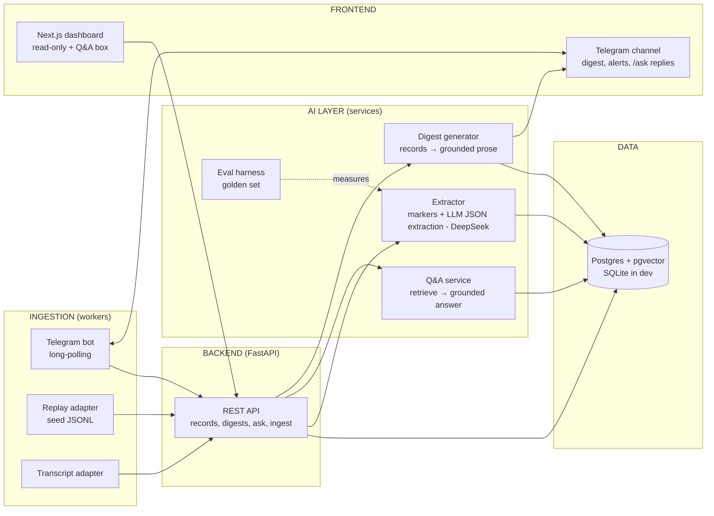

# Features — EverMind (ambient org memory) — v1 catalog

> Name: **EverMind** (renamed from working name 2026-07-18). ⚠ This is the **v1** feature
> catalog; the record model below is superseded by `design-v2.md` (decision-driven tasks) where
> they conflict. Concept: passively capture coordination signals from where the NPO already communicates (Telegram, meetings), extract typed records (decisions / blockers / status) with source citations using an LLM, and serve them back as a weekly digest, cited Q&A, blocker alerts, and onboarding briefs. Core design rule: **zero new habits for volunteers** — capture is ambient, plus one optional lightweight marker convention (`!decision`, `!blocked`) as the high-precision path.

## Design principles (from the problem statement, taken literally)

1. **Capture where people already talk** — a bot inside the existing Telegram group, not a new destination.
2. **Push, not pull** — the digest is posted into the channel; nobody has to visit a dashboard.
3. **Receipts, not paraphrase** — every extracted record links to its source message/transcript line. Trust dies with the first hallucinated "decision".
4. **Work, not people** — extract facts about work; never per-person activity metrics. Digest goes to the whole channel (shared memory, not surveillance).
5. **Additive, not load-bearing** — if the system dies, coordination continues exactly as today.

---

## Feature catalog

Tiers: **MVP** = needed to prove the concept works · **Demo** = needed for a winning 3-minute demo · **Stretch** = build only if time remains.

| ID | Feature | Tier | Complexity | Depends on |
|----|---------|------|------------|-----------|
| F1 | Normalized message store | MVP | Low | — |
| F2 | Seed/replay ingestion adapter (fake Telegram history) | MVP | Low | F1 |
| F3 | Meeting-transcript ingestion adapter | MVP | Low–Med | F1 |
| F4 | Passive LLM extraction → typed records | MVP | **High** | F1, F2/F3 |
| F5 | Marker-based capture (`!decision` / `!blocked` / `!status`) | MVP | Low | F1 |
| F6 | Extraction eval harness (golden set) | MVP | Med | F4 |
| F7 | Weekly digest generator | Demo | Med | F4/F5 |
| F8 | Cited Q&A (“why did we decide X?”) | Demo | Med | F4 |
| F9 | Telegram live bot (forward capture + `/ask` + digest post) | Demo | Med | F1–F5 |
| F10 | Blocker radar (staleness + weak signals) | Demo | Med | F4/F5 |
| F11 | Web dashboard | Demo | Med–High | F7, F8, F10 |
| F12 | Onboarding brief (“day-one packet”) | Stretch | Low–Med | F4–F8 |
| F13 | Record correction loop (emoji veto / `/forget`) | Stretch | Low | F9 |
| F14 | Notion archive (durable output) | Stretch | Low–Med | F7, F8 |

---

### F1 — Normalized message store
Everything ingested becomes one canonical shape, so every downstream feature is source-agnostic.

- **What:** `Message {id, source (telegram|transcript|replay), channel/team, author, ts, text, thread_ref, raw_ref}` persisted to the DB. This contract is the platform-agnosticism story ("connectors are 100-line adapters").
- **Inputs:** none (schema + persistence layer).
- **Complexity:** Low. SQLite for local PoC, Postgres for deploy — same SQL via a thin repository layer.
- **Risk:** none. Do this first; everything hangs off it.

### F2 — Seed/replay ingestion adapter
- **What:** Reads a checked-in JSONL file of ~4–6 weeks of *synthetic* Telegram-style chat (3 teams, ~10 personas, planted ground truth: N decisions, M blockers, statuses) and loads it through the same code path as live ingestion. Supports "replay mode" (feed messages gradually) for the live demo effect.
- **Why it exists:** Telegram bots **cannot backfill history** — a live bot only sees messages after it joins. The seed corpus is what makes memory/Q&A demos rich, and it doubles as the eval fixture.
- **Inputs:** the synthetic corpus (authored once, with a ground-truth answer key).
- **Complexity:** Low code / Medium authoring effort — the corpus is a creative artifact and **is the demo**; budget real time for it.

### F3 — Meeting-transcript ingestion adapter
- **What:** Parses a (fake) physical-meeting transcript — speaker-labelled text (`[00:14] Linh: …`) — into Messages (one per speaker turn, `source=transcript`, `channel=meeting/<date>`). Upload via CLI now, via API endpoint later.
- **Inputs:** transcript file format definition + one authored fake transcript with planted decisions/blockers.
- **Complexity:** Low–Med (parsing is easy; chunking speaker turns into extraction windows needs care).
- **Note:** this covers the "decisions happen in meetings too" story and needs no platform API at all — great demo-reliability.

### F4 — Passive LLM extraction → typed records ⚠️ the make-or-break feature
- **What:** Batch job over conversation windows (per thread, or ~30-min gaps, ~10–20 messages, with `[team | channel | date | participants]` header). The LLM extracts structured records:
  - `Decision {title, summary, rationale, decided_by, date, supersedes?, source_msg_ids[]}`
  - `Blocker {title, owner?, waiting_on, since, status, source_msg_ids[]}`
  - `Status {team, summary, period, source_msg_ids[]}`
  Every record **must** carry source message IDs → renders as clickable citations.
- **AI specifics:** DeepSeek API (**`deepseek-v4-flash`** — do NOT use `deepseek-chat`/`deepseek-reasoner`, retired 2026-07-24) through the OpenAI-compatible SDK (`base_url=https://api.deepseek.com`) — Giang's unlimited plan makes extraction cost $0. DeepSeek supports JSON mode (`json_object`) but **not** OpenAI-style strict `json_schema` on messages, so output is validated against the Pydantic record schemas with a retry-on-invalid wrapper — schema enforcement lives on our side. (Alternative if that wobbles: strict function-calling beta, `base_url=https://api.deepseek.com/beta` + `"strict": true` tool defs, gives server-side schema validation.) The AI layer stays provider-agnostic: model + base URL are env config, so if extraction precision won't converge on DeepSeek, swapping to Claude or any OpenAI-compatible endpoint is a config change, not a rewrite. Batch/on-demand, not per-message; retry-with-backoff on 429/503 (DeepSeek's known load pattern). Dedup pass: a new record that matches an existing one (same window/topic) updates rather than duplicates.
- **Inputs:** prompt + record schemas + the golden set (F6) to iterate against.
- **Complexity:** High — not the code (one API call) but the *quality iteration*: messy informal chat, Vietnamese/English mix (if applicable), avoiding hallucinated decisions. Precision >> recall: a missed decision is invisible; an invented one destroys trust.
- **Dependency:** F1 (messages), F6 (to measure quality before building UI on top).

### F5 — Marker-based capture (the "structure-assisted" path)
- **What:** Deterministic regex path: messages containing `!decision …` / `!blocked …` / `!status …` create records directly (LLM only enriches title/summary). Human-asserted = 100% precision.
- **Why:** trust anchor, graceful degradation if F4 wobbles, and the honest answer to "what if the LLM gets it wrong" — *humans can always assert; the AI catches what they didn't*.
- **Complexity:** Low. Ship early, demo alongside F4.

### F6 — Extraction eval harness
- **What:** ~20 hand-labelled conversation windows from the seed corpus (the planted ground truth) + a script that runs F4 against them and reports precision/recall per record type. Run on every prompt change.
- **Complexity:** Med (mostly labelling discipline).
- **Why MVP:** without it, "let's see if it works" has no answer. This is the day-one de-risking task.

### F7 — Weekly digest generator
- **What:** Reads the record store for a date range → renders per-team digest: shipped/progress, **decisions with rationale + citation**, open blockers with age, asks. Output: Markdown → posted to Telegram (F9) and shown in dashboard (F11). LLM used for the summary prose, grounded strictly on records (not raw chat), each line cited.
- **Complexity:** Med. Deterministic query + one grounded generation call.
- **Demo beat:** "Monday 9:00 — the digest nobody compiled."

### F8 — Cited Q&A
- **What:** Natural-language question → retrieve candidate records + source windows → answer with citations (record + source message + date). Handles temporal logic: a superseded decision answers with the *current* one, noting the change.
- **Retrieval:** start with SQL/keyword + record-type filters (records are small and structured — likely enough for the demo corpus); add pgvector embeddings only if recall disappoints. Don't build embeddings first.
- **Complexity:** Med.
- **Demo beat:** the volunteer-rotation moment — new member asks "why did we switch venues?" and gets the answer + link + who/when.

### F9 — Telegram live bot
- **What:** Long-polling bot (`getUpdates`, no public URL needed) that: ingests new group messages → F1; handles `/ask <question>` → F8 inline; posts the digest to the channel; handles `/digest` on demand.
- **Constraints to respect:** privacy mode must be disabled via BotFather **before** adding to the group (or make bot admin); no history backfill (hence F2); bots can't see other bots.
- **Inputs:** a bot token (from BotFather — only you can create it), a demo group.
- **Complexity:** Med. Failure modes are config, not code — rehearse the setup.

### F10 — Blocker radar
- **What:** Two signal paths merged: (a) **deterministic staleness** — blocker record with no follow-up in N days → escalate (a SQL query, zero ML — say so in the pitch); (b) **weak conversational signals** — extraction flags "still waiting on…", unanswered asks. Alerts post to the channel (shared, not DM'd to leaders — surveillance optics).
- **Complexity:** Med. Precision matters: false-positive pings erode trust fast; tune thresholds on seed data.

### F11 — Web dashboard
- **What:** Read-only views over the record store: digest archive, decision log (filter/search), blocker board with age, team timeline, and the Q&A box. This is the judge-facing surface; volunteers get everything in Telegram.
- **Complexity:** Med–High. **Decided (2026-07-17): Next.js on Vercel.** Under the 48h clock, ship views in priority order (decision log → blocker board → digest archive → Q&A box) and stop when time runs out — the backend API is identical regardless of how many views land.

### F12 — Onboarding brief (stretch)
- **What:** `/onboard <team>` (or auto on join): generates a scoped packet — active work, the decisions shaping it (with citations), open blockers, who owns what. Cheap: it's a re-filter of records that already exist.
- **Complexity:** Low–Med. Highest emotional payoff per unit effort if the spine is done.

### F13 — Record correction loop (stretch)
- **What:** React 👎 on a bot-posted record (or `/forget <id>`) → record marked rejected, excluded from digests/Q&A. The trust/consent story made concrete.
- **Complexity:** Low.

### F14 — Notion archive (stretch)
- **What:** Write digest + decision log into a Notion database (write-only integration). The sustainability answer: *"the tool is disposable; the memory is not."*
- **Complexity:** Low–Med (internal integration token; remember per-page connection sharing; pin API version).

---

## Architecture

Clean separation so each layer is swappable and independently testable. **The AI layer is a transform stage in a data pipeline** — that's what keeps the demo robust.



### Layer responsibilities & boundaries

| Layer | Owns | Must NOT do |
|---|---|---|
| **Ingestion workers** (Python) | Platform specifics: Telegram API, file parsing, replay pacing. Emit canonical `Message` objects to the backend. | No LLM calls, no business logic. A connector is ~100 lines. |
| **AI layer** (Python modules) | Prompts, schemas, extraction, grounded generation, retrieval, eval. Pure functions: `messages in → records out`, `records + question in → cited answer out`. | No direct DB writes (returns objects; backend persists). No platform awareness. |
| **Backend** (FastAPI) | Persistence, API for FE + workers, scheduling (digest cron, staleness checks), auth (a shared token is enough for hackathon). | No prompt text, no platform SDKs. |
| **Data** (Postgres/pgvector; SQLite dev) | `messages`, `records`, `record_sources` (citation join), `teams`, `digests`. | — |
| **Frontend** (Next.js) | Read-only views + Q&A box; calls backend REST only. | No DB access, no LLM calls. |
| **Infra** | Docker Compose (api + worker + db), env-based config, one `make demo` entrypoint. | See deployment.md. |

### Key contracts (freeze early)

```
Message  {id, source, channel, team?, author, ts, text, thread_ref?, raw_ref}
Record   {id, type: decision|blocker|status, title, body(json per type),
          team, created_from: marker|llm, confidence, status: active|superseded|rejected}
Citation {record_id, message_id}   -- every record ≥1 citation, enforced
```

## Cross-cutting concerns

- **Extraction quality** — the single biggest risk. Mitigations: golden set before UI (F6), precision-biased prompts, marker fallback (F5), citations everywhere, correction loop (F13).
- **Privacy/consent framing** — opt-in channels only (bot presence = visible consent), work-not-people extraction, whole-channel outputs, published record schema. Feature-level design, not a disclaimer slide.
- **LLM cost** — batch extraction on conversation windows + on-demand Q&A; no per-message calls (window batching stays even with an unlimited plan — it's also latency + rate-limit hygiene). Hackathon cost: $0 (unlimited DeepSeek plan). For the NPO-handoff pitch, quote pay-as-you-go DeepSeek or any OpenAI-compatible provider — pennies per month at NPO scale.
- **Demo reliability** — every AI feature has a deterministic sibling (markers, staleness SQL, seed corpus) so a live wobble never stalls the demo.
